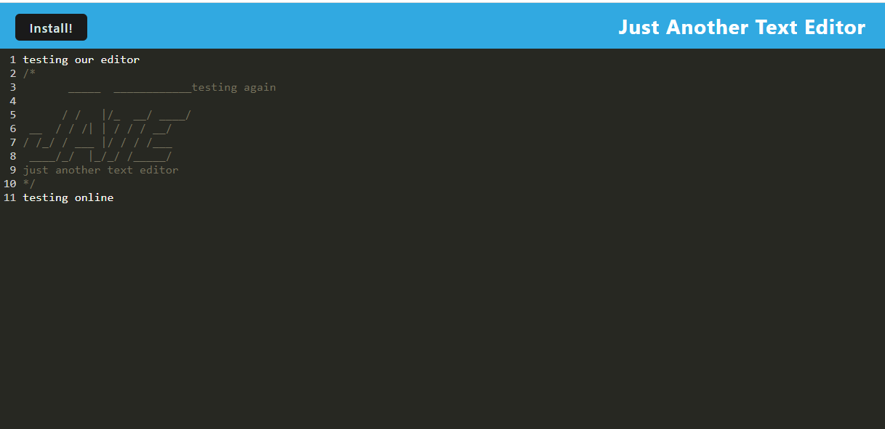

# 19 Progressive Web Applications (PWA): Text Editor

## Description

This text editor single-page application runs in the browser as well as offline. It is a PWA application that features a number of data persistence techniques that serve as redundancy in case one of the options is not supported by the browser. 

### Technologies Used

* indexDB
* manifest.JSON
* webpack
* babel
* service-worker

### Screenshot

https://github.com/bussudo/PWATextEditor
